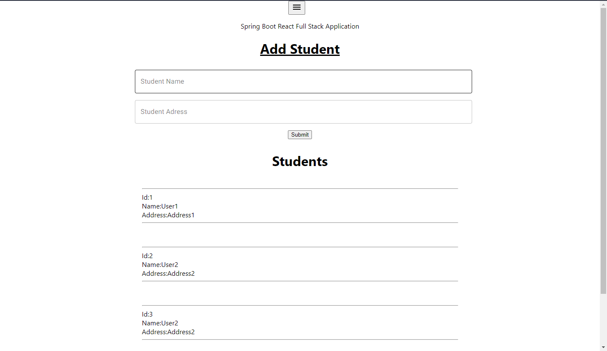

# SpingBoot API App

src/ main resources/ application.proprietes

open Only the server with Intelij idea like: \GitHub\SpingBootFullStackApp\server

## All Routes

### Student Admin

```
GET      localhost:8080/student/getAll
POST     localhost:8080/student/add
PUT      localhost:8080/student/add --- not yet
DELETE   localhost:8080/student/add --- not yet
```

### Authentication Seller

```
POST     /api/users/register
POST     /api/users/login
POST     /api/users/forgotpassword
PUT      /api/users/resetpassword
```

## Screenshots

|                                                          |                                                          |
| :------------------------------------------------------: | :------------------------------------------------------: |
|   |   |
|   |   |
|   |   |
|   |   |
|   |   |
|  |  |
|  |  |
|  |  |
